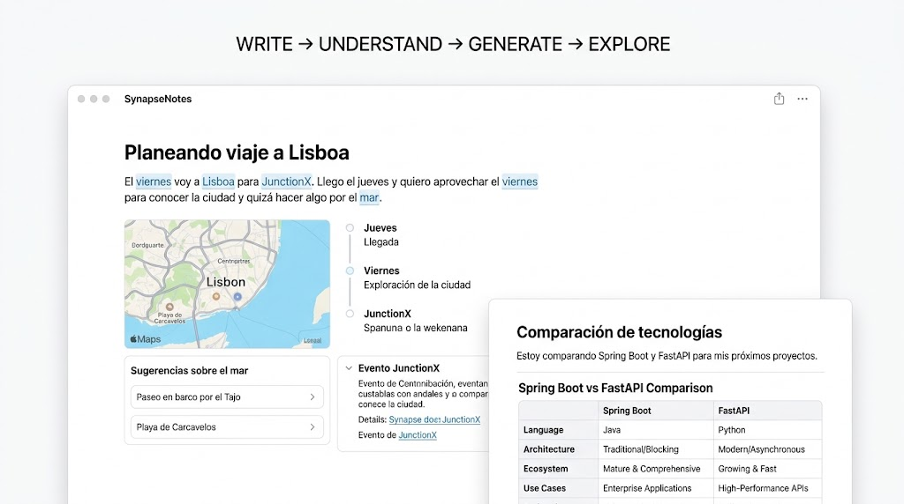

# AuraNote

> Un documento cuya interfaz no está prediseñada: emerge de lo que escribes.



## Qué es

No es "notas con IA" — no resume, no corrige, no hay un chat en un panel lateral.

Es un editor de texto donde **el contenido genera la interfaz**. Escribes un párrafo
sobre un viaje a Lisboa y ese párrafo puede convertirse en un mapa, una línea temporal
y unas sugerencias. Escribes otro comparando Spring Boot y FastAPI y da algo
completamente distinto. Mismo gesto, resultado distinto, porque **el texto es la
materia prima de la interfaz**.

```
WRITE  →  UNDERSTAND  →  GENERATE  →  EXPLORE
```

## Los dos niveles

Ambos operan sobre lo mismo: **un fragmento que seleccionas**. Se diferencian en ambición.

|                | Convertir en sección          | Generar artefacto              |
| -------------- | ----------------------------- | ------------------------------ |
| **Modelo**     | LLM + prompt de tu librería   | LLM, código libre              |
| **Tiempo**     | ~5 s (~1 s con OUI-1 local)   | 10-30 s                        |
| **Salida**     | `openui-lang` con tus piezas  | Código libre                   |
| **Render**     | Componentes Vue nativos       | `<iframe sandbox>`             |
| **Garantía**   | Siempre encaja con el diseño  | Puede ser cualquier cosa       |

> Tu librería de componentes es el vocabulario del documento.
> El artefacto es la fuga de ese vocabulario.

## Stack

| Capa       | Elección                    | Por qué                                                    |
| ---------- | --------------------------- | ---------------------------------------------------------- |
| Front      | Vue 3 + Vite                | TipTap nació como librería de Vue                          |
| Editor     | TipTap (ProseMirror)        | Node views y decorations — ver [arquitectura](docs/arquitectura.md) |
| Estilos    | Tailwind + Motion           | Sistema propio; OpenUI no distribuye componentes           |
| Nivel 1    | GPT-4o + `library.prompt()` | C1 no sirve OUI-1; autoalojarlo es la mejora de latencia   |
| Renderer   | `@openuidev/vue-lang`       | Oficial. Genera el system prompt desde tu librería         |
| Nivel 2    | GPT-4o vía API              | Cualquier endpoint compatible con OpenAI                   |
| Mapas      | Leaflet + OpenStreetMap     | Sin API key                                                |
| Back       | Ninguno al principio        | Solo proxy para las keys. FastAPI entra con GLiNER         |

## Documentación

| Documento                                        | Contenido                                          |
| ------------------------------------------------ | -------------------------------------------------- |
| [Concepto](docs/concepto.md)                     | La idea, los dos niveles, qué **no** es            |
| [Arquitectura](docs/arquitectura.md)             | Pipeline y decisiones técnicas razonadas           |
| [Componentes](docs/componentes.md)               | La librería que OUI-1 puede componer               |
| [UX](docs/ux.md)                                 | Cuándo generar, reglas anti-molestia               |
| [Diseño](docs/diseno.md)                         | Tokens, los dos registros visuales, movimiento     |
| [Decisiones](docs/decisiones.md)                 | Registro de lo decidido **y lo descartado**        |
| [Roadmap](ROADMAP.md)                            | Fases con criterios de "listo"                     |
| [Referencias](docs/referencias.md)               | OUI-1, Disco, GLiNER, TipTap                       |
| [Conversación original](docs/conversacion-original.md) | De dónde salió todo esto                     |

## Estado

🌿 **Funcionando de punta a punta.** Los dos niveles generan con modelos reales.
Prueba de concepto — Proyecto de fin de semana para validar la idea y
experimentar con generación libre de interfaces. No es un producto.

## Tesis técnica

Usar **el modelo más pequeño que resuelva cada tarea** en vez de mandarlo todo a uno
gigante. Un modelo de 4B genera la interfaz en un segundo; el modelo grande solo
aparece cuando pides algo ambicioso. Ver [decisiones](docs/decisiones.md).
